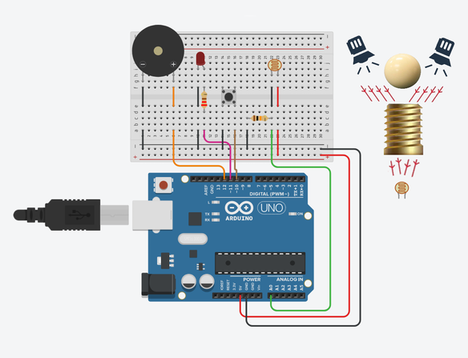

# Indy LDR Buzzer Alarm (Arduino Microcontroller)

## Project utilizes:

* Arduino UNO microcontroller
* Half-sized breadboard
* Arduino IDE (2.X)

## Circuit components:

1. LDR (Light-dependent resistor)
2. Red LED, 5mm
3. Piezo Passive Buzzer (wide range of frequencies)
4. Tactile Pushbutton Switch (12x12)
5. 220Ω Resistor
6. 10kΩ Resistor
7. Solid core jump wires (13x)
8. Red & black jump wires (4x)
9. Props: treasure ball & stand (2x)

## Visual assembly diagram:

### Description:

A program made for the Arduino that defines a melody theme song and triggers an alarm.
In this case, the chosen theme melody is Indiana Jones: 'Raiders March' to fit the overall theme of the project.
Only when the melody is active, the program is running a LDR (light-dependent resistor) sensor that triggers an alarm
if the treasure ball is displaced from the stand to the point enough light is passed through to the LDR.

The code starts by defining the pin connections for the LDR sensor, red LED, buzzer, and button.
It then defines the frequencies and durations of musical notes for the melody theme.
The melody theme is defined using an array of musical notes and an array of note durations.

The setup function initializes the pins for input and output, starts the serial communication, and sets the initial
state of the melody and button variables.

The loop function continuously checks the state of the button and the value of the LDR sensor.
If the button is pressed, the melody theme is played from its begining note. If the button is pressed again
while the melody is already active, the melody is stopped and reseted. If the LDR value exceeds a certain threshold,
the melody stops and the alarm sounds indefinitely until the Arduino is either manually reset or the power isturned off.

Aditionally, a small Python script was added to the project which can be used to deactivated through a computed device 
by using the serial COM port to communicate with the Arduino processor. 

