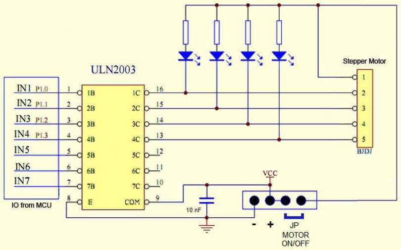

# 5V Stepper Motor (28BYJ-48) w/ ULN2003 Driver (Arduino MCU)

This project demonstrates how to control a basic 5V stepper motor (28BYJ-48) using an Arduino microcontroller.
The code allows the motor to perform rotations both clockwise and counterclockwise directions.
The speed and acceleration can be adjusted in the code to suit different applications.
This setup is suitable for projects that require precise control of rotational movements, such as robotics, automation,
or small-scale CNC machines.

## Hardware Requirements:

* Arduino UNO R3 board
* Arduino IDE (2.X)
* 5V 28BYJ-48 5V stepper motor with ULN2003 driver module
([Datasheet](https://www.mouser.com/datasheet/2/758/stepd-01-data-sheet-1143075.pdf))
* External power supply
* Connecting wires

## Circuit Diagram:

1. Connect IN1, IN2, IN3 and IN4 pins of the ULN2003 driver to the digital I/O pins on the Arduino MCU
2. Connect the VCC pin of the ULN2003 driver to the 5V external power supply module
3. Connect the GND pin of the ULN2003 driver to a common GND rail shared by the Arduino MCU and the external power
supply module

## Circuit Schematic:

## Code Explanation:

### Stepper Library Code

This sketch controls the stepper motor using the Stepper library in Arduino.
It rotates the motor both clockwise and counterclockwise, with a specific delay between movements.
The code divides one full revolution into smaller segments and controls the motor speed using RPM
(Revolutions Per Minute).

### Variables and Constants:

**stepsPerRevolution:** Defines the number of steps required for the motor to complete one full 360° rotation.
For this particular motor, one full revolution has 2048 steps.

**revolutionsPerMinute:** Specifies the speed of the motor in RPM (9 RPM).

### Setup Function:

**myStepper.setSpeed(revolutionsPerMinute):** Sets the speed of the motor using RPM.
**Serial.begin(9600):** Initializes serial communication for debugging and monitoring motor movement.

### Loop Function:

*Clockwise Rotation:*

A for loop divides one full revolution into 8 segments, moving the motor by one-eighth of a full rotation in each
iteration. After each step, the motor pauses for 2 seconds before moving to the next segment.

*Counterclockwise Rotation:*

After the clockwise movement is complete, the motor rotates one full revolution in the counterclockwise direction.
A delay of 1 second is added after the counterclockwise rotation.

### AccelStepper Library Code
This sketch utilizes the AccelStepper library to control the 5V stepper motor with acceleration and speed control.
The motor rotates both clockwise and counterclockwise, with each direction being executed with smooth acceleration and
deceleration.

### Variables and Constants:

**stepsPerRevolution:** Defines the number of steps required for the motor to complete one full 360° rotation,
set to 2048 steps.

**maxSpeed:** Specifies the maximum speed of the motor in steps per second, set to 800 steps/second.
acceleration: Defines the rate of acceleration in steps per second², set to 6 steps/second².

### Setup Function:

**myStepper.setMaxSpeed(maxSpeed):** Sets the maximum speed for the motor.
**myStepper.setAcceleration(acceleration):** Defines the acceleration rate for the motor.

### Loop Function:

*Set Current Position to Zero:*

At the start of each loop iteration, the motor's current position is set to zero using myStepper.setCurrentPosition(0).
This ensures consistent movement and positioning from a known reference point.

*Clockwise Rotation:*

The motor is instructed to move one full revolution in the clockwise direction using
myStepper.moveTo(stepsPerRevolution). The while loop ensures the motor continues running until the target position is
reached.

*Pause:*

A 3-second delay is added between the clockwise and counterclockwise rotations.

*Counterclockwise Rotation:*

After resetting the position to zero, the motor is instructed to rotate one full revolution in the counterclockwise direction.
The while loop ensures the motor continues running until the target position is reached.

## Live Presentation

## Author

[th0tmaker](https://github.com/th0tmaker) - *"makeshift developer and maker of thots!"*