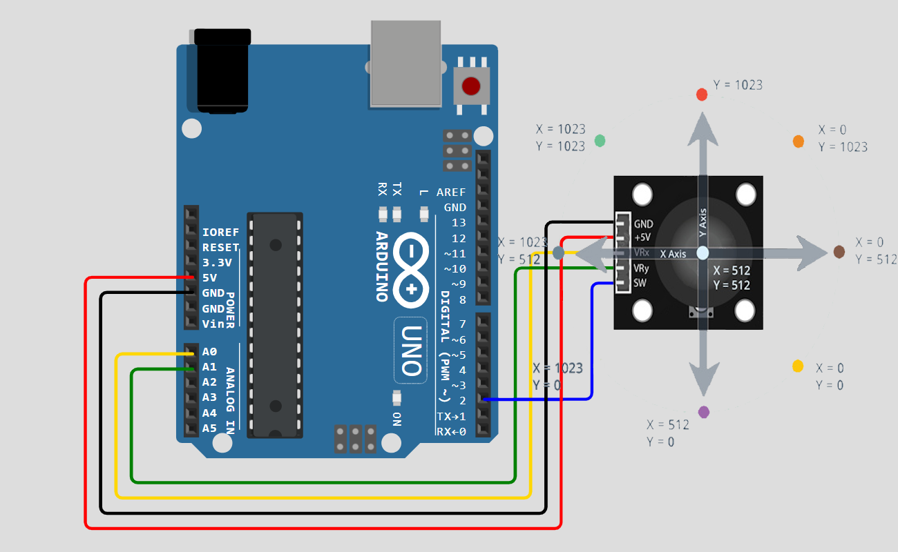

# Joystick Controller (Arduino MCU)

This is an Arduino sketch that is programmed to read a standardized joystick module. 
The code defines the joystick's movement direction (LEFT, RIGHT, UP, DOWN)
by reading an analog input based on the joystick's horizontal and vertical position, which
is translated into a digital signal ranging from 0 to 1024. 
The code also takes into account and reads the joystick's pushbutton status, which
can be either a digital value of '0' (released) or '1' (pressed). 
This sketch can only be used effectively with applications that require basic directional input
like moving LEFT, RIGHT, UP and DOWN. It is NOT suitable for applications that call for diagonal movement
or precise and detailed movement.

## Hardware Requirements:

* Arduino UNO R3 board
* Arduino IDE (2.X)
* KY-023 Joystick module ([Datasheet](https://naylampmechatronics.com/img/cms/Datasheets/000036%20-%20datasheet%20KY-023-Joy-IT.pdf))
* Half-sized breadboard (optional)
* Connecting wires

## Circuit Diagram:

1. Connect the X-axis pin of the joystick to A0 on the Arduino
2. Connect the Y-axis pin of the joystick to A1 on the Arduino
3. Connect the Button pin of the joystick to Digital Pin 2 on the Arduino
4. Connect the VCC pin of the joystick to 5V on the Arduino
5. Connect the GND pin of the joystick to GND on the Arduino

## Visual Assembly Diagram:

## Code Explanation:

### Variables and Constants

* VRx: Analog pin for the X-axis input from the joystick
* VRy: Analog pin for the Y-axis input from the joystick
* BTN: Digital pin for the button input from the joystick
* xVal: Stores the current X-axis reading
* yVal: Stores the current Y-axis reading
* btnState: Stores the current button state
* centerVal: The center positional value of the joystick (default is 512)
* threshold: Used to determine the sensitivity of the joystick.
Specifically, it sets a limit for how much the joystick's position must deviate
* from the center before it is considered to be moved in a particular direction. (default is 50)
* dir: Stores the direction value based on the joystick's position

### Setup Function

* Initialize the serial communication at 9600 baud rate
* Set the button pin mode to INPUT_PULLUP to enable the internal pull-up resistor. 
When a digital input pin is not connected to a definite voltage (HIGH or LOW),
it is said to be "floating." A floating input pin can pick up noise from the environment,
leading to unstable behavior. A pullup resistor ensures that the input pin reads HIGH when the button is not pressed.

### Loop Function

1. Read Joystick Values:

* xVal and yVal are read from the analog pins VRx and VRy, respectively
* btnState is read from the digital pin BTN

2. Calculate Deviation:
* xDev and yDev calculate the deviation of the joystick from the center position

3. Determine Direction:

Based on the deviation and threshold values, the direction is determined:

* If the X-axis deviation is dominant, the direction is either "Left" or "Right"
* If the Y-axis deviation is dominant, the direction is either "Up" or "Down"
* If the joystick is within the threshold range, the direction is "Center"

4. Print Output:
* The current direction (either LEFT, RIGHT, UP, DOWN) is printed to the Serial Monitor
* The button state is '1' when pressed and '0' when not pressed

5. Delay:
* A short delay ensures a more stable working environment for the program read its inputs and
perform outputs. However, using too much delay will produce a program that does not update the current direction and
buttons tate values at quick enough intervals, leading to a joystick that's less responsive, especially if being used
via serial communication with an outside source. 

## Usage

1. Connect the joystick module to the Arduino as per the circuit diagram
2. Upload the sketch to the Arduino board
3. Open the Serial Monitor (Ctrl + Shift + M) to observe the joystick's direction and button state
4. If you want to use the joystick module together with another application, write additonal code outside this sketch
on a programming language of your choice that handles serial communication between your application and the Arduino with
the connected joystick at its specific COM port. 

## Author

[th0tmaker](https://github.com/th0tmaker) - *"makeshift developer and maker of thots!"*